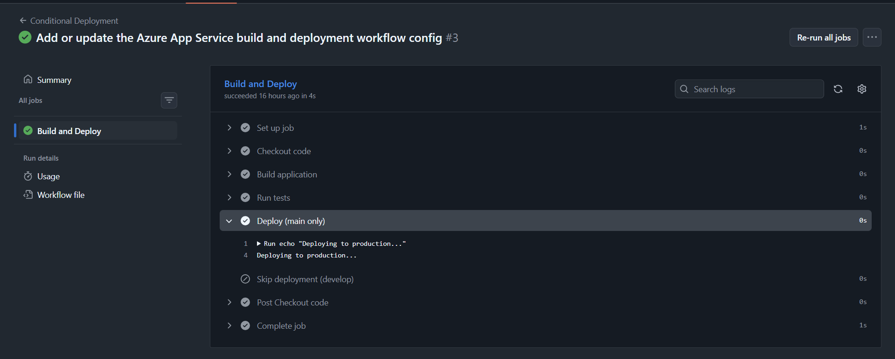
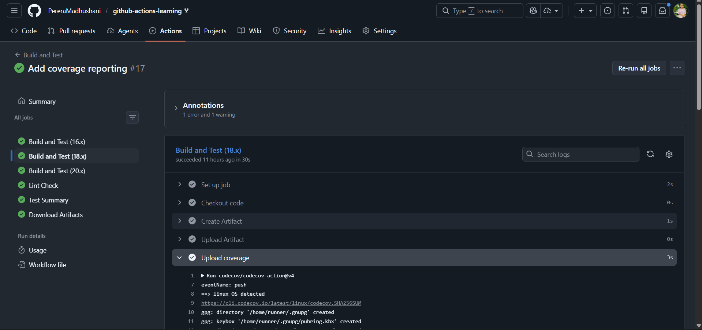
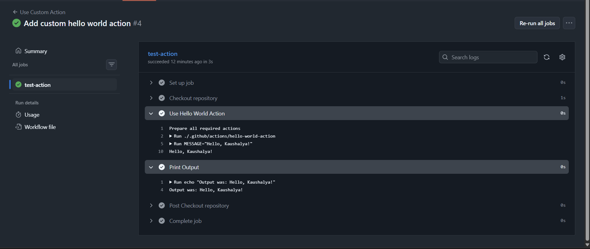

#  GitHub Actions Advanced Tasks – Completion

## 👤 Author
Name: Kaushalya Perera  
Branch: working-advanced-kaushalya  

---

#  Completed Tasks

##  Task 8: Upload and Download Artifacts

###  Implemented:
- Created artifact after build step
- Uploaded artifact using `actions/upload-artifact`
- Created dependent job
- Downloaded artifact using `actions/download-artifact`

###  Evidence:

---

##  Task 9: Conditional Execution

### ✔ Implemented:
- Created `conditional.yml`
- Used `if: github.ref == 'refs/heads/main'`
- Verified:
  - Push to `develop` → Deploy step skipped
  - Push to `main` → Deploy step executed

###  Evidence:
.png)
.png)
---

##  Task 10: PR and Issue Templates

### ✔ Implemented:
- Forked repository
- Created branch `feature/my-feature`
- Made change to sample app
- Created Pull Request using template
- Created Issue using template

###  Evidence:
.png)
.png)

---

#  Challenge Tasks

##  Challenge 1: Deploy to Azure

###  Implemented:
- Created Azure App Service
- Created Service Principal
- Added `AZURE_CREDENTIALS` secret
- Deployment workflow successful
- App accessible via Azure URL

### Evidence:

##  Challenge 2: Code Coverage

###  Implemented:
- Added Codecov action
- Uploaded coverage report
- Verified coverage in Codecov dashboard

###  Evidence:

##  Challenge 3: Custom Action

### ✔ Implemented:
- Created `.github/actions/hello-world-action`
- Defined inputs and outputs
- Used in workflow
- Verified execution logs

###  Evidence:
- 

