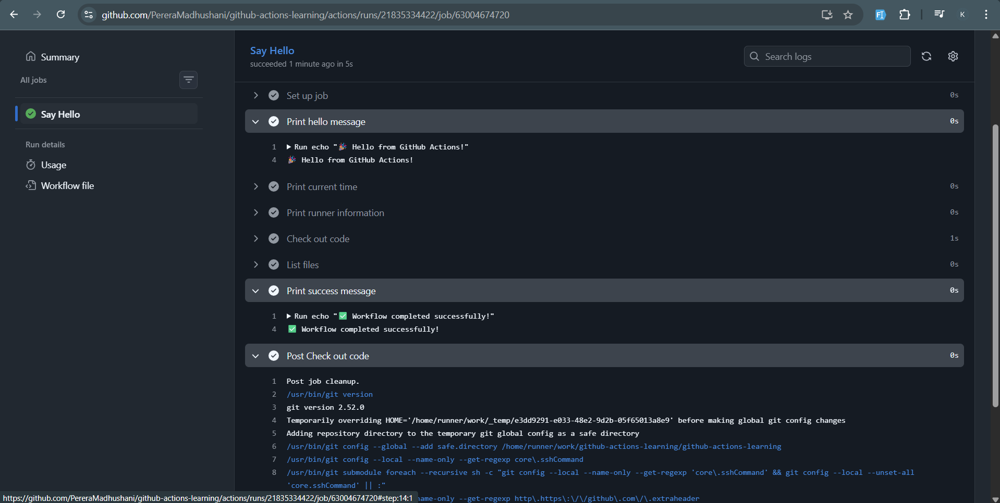
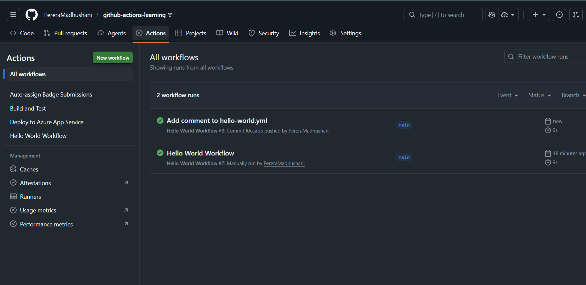
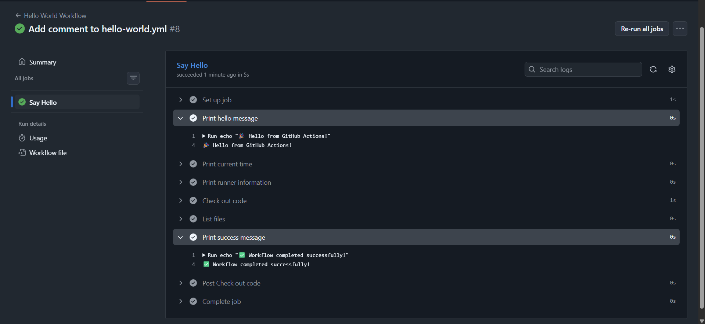
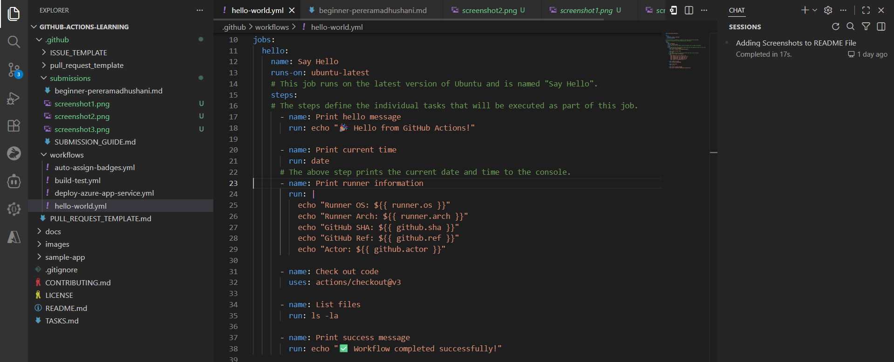
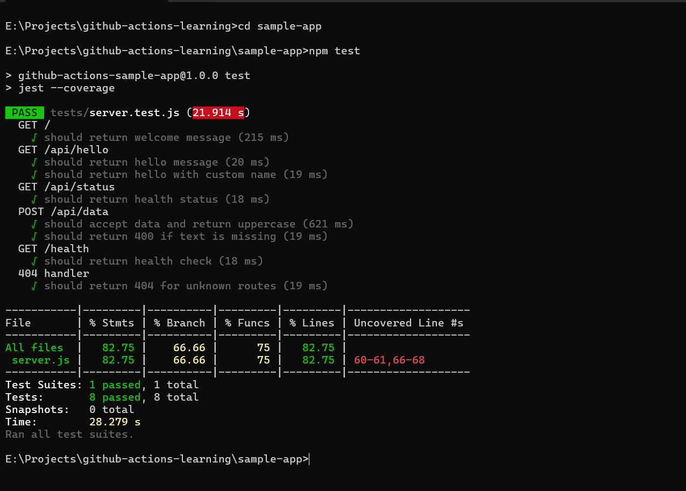
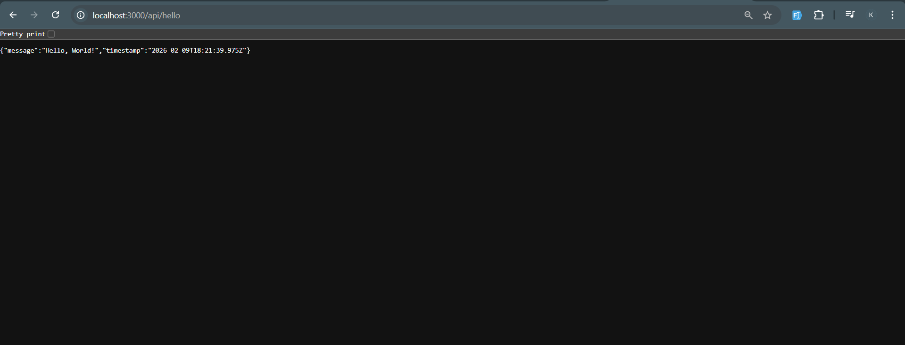
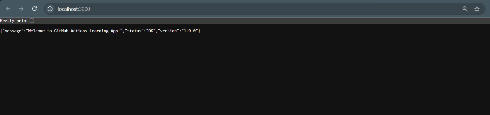
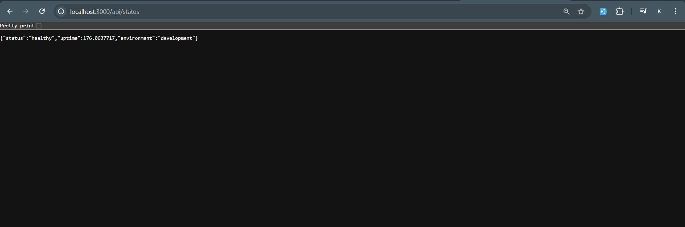

# Beginner Badge Submission - Pereramadhushani

**Date:** February 2026  
**Status:** Submitted for Review

## Tasks Completed

- [x] Task 1: Run Your First Workflow
- [x] Task 2: Understand Workflow Triggers
- [x] Task 3: Build and Test Locally

## Evidence

### Task 1: Hello World Workflow
Successfully ran the Hello World workflow manually through the GitHub Actions UI. The workflow executed all steps and provided detailed logs showing echo outputs.

---

### Task 2: Understand Workflow Triggers
Edited the hello-world.yml workflow and pushed changes to the main branch. The workflow automatically triggered on the push event, demonstrating event-based workflow execution.

---

### Task 3: Build and Test Locally
Successfully built and tested the sample application locally. Ran `npm install`, `npm test`, and `npm start` commands. All tests passed and the application server started successfully.

#### Test Results:

#### API Testing:

---

## Summary

All three beginner tasks have been completed successfully:
-  Manually triggered and observed workflow execution
-  Verified automatic workflow triggers on code push
-  Built, tested, and ran the sample application locally with all tests passing

The application is fully functional with API endpoints responding correctly.

---

Submitted & ready for review!
