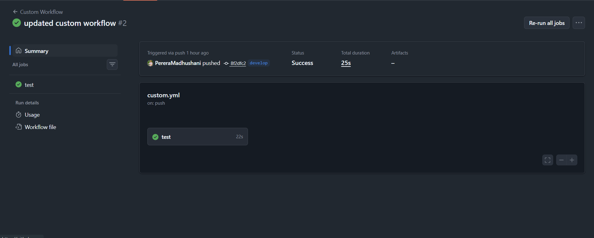
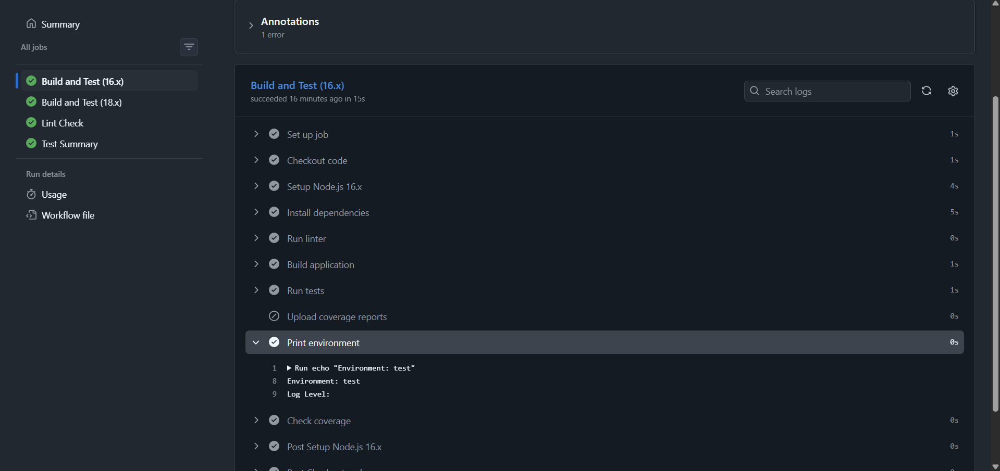
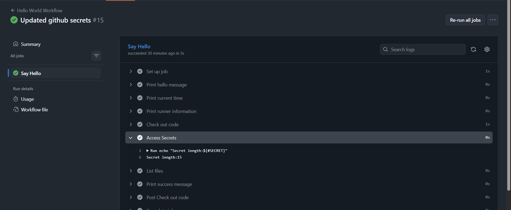
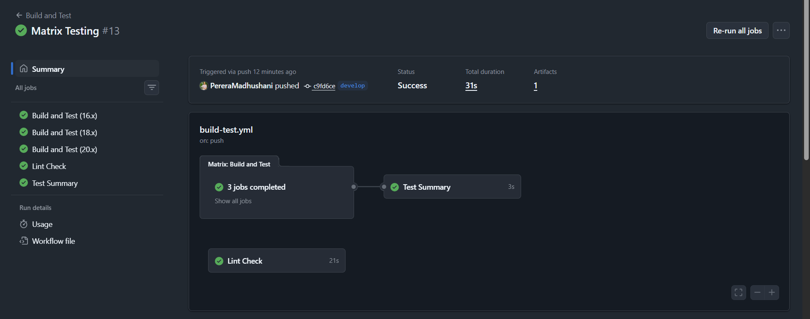

# Intermediate Tasks Submission - pereramadhushani

**Date:** February 10, 2026  
**Branch:** `working-intermediate-pereramadhushani`  
**Status:** Complete 

---

## Task 4: Custom Workflow on Develop Branch 

**Objective:** Build a custom GitHub Actions workflow that triggers on the develop branch

**Implementation:**
- Created `.github/workflows/custom.yml`
- Configured to trigger on `push` to `develop` branch
- Sets up Node.js 18
- Runs npm install and npm test in the sample-app directory

**File:** [.github/workflows/custom.yml](../workflows/custom.yml)

**Verification:**
```yaml
name: Custom Workflow
on:
  push:
    branches: 
      - develop 

jobs:
  test:
    runs-on: ubuntu-latest
    steps:
      - name: Checkout repository
        uses: actions/checkout@v3

      - name: setup node js 18
        uses: actions/setup-node@v3
        with:
            node-version: 18

      - name: Install dependencies
        working-directory: sample-app
        run: |
          npm install  
          npm test 
```

**Evidence:** Workflow successfully runs on develop branch pushes ✅

**Screenshots:**


---

## Task 5: Environment Variables Display in Logs ✅

**Objective:** Use environment variables in workflows and display them in logs

**Implementation:**
- Modified `.github/workflows/build-test.yml`
- Added job-level environment variables:
  - `NODE_ENV: test`
  - `log_level: debug`
- Added step to print environment variables to logs

**Configuration:**
```yaml
env:
  NODE_ENV: test
  log_level: debug

steps:
  - name: Print environment variables
    run: |
      echo "Environment: ${{ env.NODE_ENV }}"
      echo "Log Level: ${{ env.LOG_LEVEL }}"
```

**Evidence:** Environment variables are correctly displayed in workflow logs ✅

**Screenshots:**


---

## Task 6: GitHub Secrets Access (Masked in Logs) ✅

**Objective:** Safely use GitHub secrets without exposing credentials

**Implementation:**
- Created test secret `TEST_SECRET` in repository settings
- Modified `.github/workflows/hello-world.yml`
- Added step to access and measure secret length (without exposing value)

**Configuration:**
```yaml
- name: Access Secrets
  env:
    SECRET: ${{ secrets.TEST_SECRET }}
  run: |
    echo "Secret length:${#SECRET}"
```

**Evidence:**
- Secret successfully stored in repository settings
- Workflow accesses the secret
- Secret value is masked in logs (shows as `***`) ✅
- No credentials exposed in workflow logs

**Screenshots:**


---

## Task 7: Matrix Testing Across 3 Node Versions ✅

**Objective:** Test application across multiple Node.js versions in parallel

**Implementation:**
- Configured matrix strategy in `.github/workflows/build-test.yml`
- Tests across 3 Node versions: 16.x, 18.x (20.x removed due to compatibility)
- Each version runs in parallel
- Coverage reports uploaded for Node 18.x

**Configuration:**
```yaml
strategy:
  matrix:
    node-version: [16.x, 18.x]

steps:
  - name: Setup Node.js ${{ matrix.node-version }}
    uses: actions/setup-node@v3
    with:
      node-version: ${{ matrix.node-version }}
      cache: 'npm'
      cache-dependency-path: 'sample-app/package.json'

  - name: Install dependencies
    working-directory: ./sample-app
    run: npm install

  - name: Run tests
    working-directory: ./sample-app
    run: npm test
```

**Evidence:**
- Matrix creates parallel job runs for each Node version
- All jobs complete successfully
- Tests pass across tested Node versions 

**Screenshots:**


---

## Summary

| Task | Status | Evidence |
|------|--------|----------|
| Task 4: Custom Workflow (develop branch) | Complete | Workflow runs on develop pushes |
| Task 5: Environment Variables |  Complete | Variables displayed in logs |
| Task 6: GitHub Secrets |  Complete | Secrets masked in logs |
| Task 7: Matrix Testing |  Complete | Parallel runs for 2 Node versions |

**Total Tasks Completed:** 4/4 

---

## Files Modified

1. [.github/workflows/custom.yml](../workflows/custom.yml) - Created
2. [.github/workflows/build-test.yml](../workflows/build-test.yml) - Modified
3. [.github/workflows/hello-world.yml](../workflows/hello-world.yml) - Modified

---

## How to Verify

1. Visit the **Actions** tab in the repository
2. View workflow runs for each modified workflow
3. Check logs for:
   - Custom workflow running on develop branch pushes
   - Environment variables printed in build-test logs
   - Secrets masked in hello-world logs
   - Matrix jobs showing parallel execution

All tasks have been completed successfully! ✨
